## **UNIT II**

___

## **DATA, EXPRESSIONS, STATEMENTS**

___

Python interpreter and interactive mode - values and types: int, float, boolean,
string, and list- variables, expressions, statements-tuple assignment-
precedence of operators - comments; Modules and functions - function definition
and use - flow of execution - Parameters and arguments - Illustrative programs:
exchange the values of two variables, circulate the values of n variables,
distance between two points.

___

**TABLE OF CONTENTS**

-   Unit II -- Data, Expressions and Statements

    -   The Python Programming language

    -   Python Interpreter and its mode

        -   Normal Mode

        -   Interactive Mode

    -   Value and Types

        -   Integer

        -   Float

        -   Boolean

        -   String

        -   List

    -   Variable Expression and Statements

    -   Tuple Assignment

    -   Operators and Precedence

        -   Operators

        -   Precedence of Operator

    -   Comments

    -   Modules and Functions

        -   Function Definition

            -   Function Call

        -   Flow of Execution

        -   Parameter and Arguments

        -   Modules

**2.0 The Python programming language**

Python is an interpreted, high-level, general-purpose programming language.

Programs written in a high-level language have to be processed before they can
run. A program needs to be translated in to a low level language that a machine
(computer) can understand.

There are two kinds of programs process high-level languages into low-level
languages:

-   Interpreters

-   Compiler

An **interpreter** processes the program a little at a time, alternately reading
lines and performing computations.

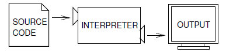

In the above diagram a python program is the source code and the interpreter
translates and executes the statement.

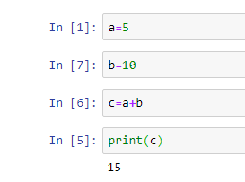

In the above figure, notice that interpreter provide us a flexibility to
translate every individual line separately. In case if any changes are made in
any of the lines or sections. Only that particular line could be subjected to
interpreter for processing. That the benefit of Interpreter.

On the other hand, a compiler reads the program and translates it completely
before the program starts running. Here the high-level program is called the
source code, and the translated program is called the object code or the
executable. Once a program is compiled, you can execute it repeatedly without
further translation.

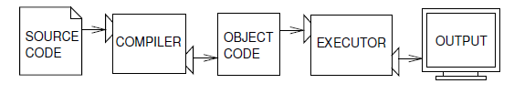

**2.1 Python Interpreter and its mode:**

An interpreter is a kind of program that executes other program. A python
interpreter reads your program and carries out the instructions it contains.

Python Interpreter operates in two modes:

-   Normal Mode or Script Mode

-   Interactive Mode

**2.1.1 Normal Mode**

The normal mode is the mode where the scripted and finished .py files are run in
the Python interpreter. A script usually contains a sequence of statements. If
there is more than one statement, the results appear one at a time as the
statements execute.

For example, the script executes and produces the output one by one.

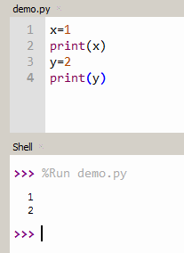

**2.1.2 Interactive Mode**

To start python interactive mode follows the steps

1.  Open a command Window/Terminal

2.  Type **Python**

When it starts, you should see output like this:

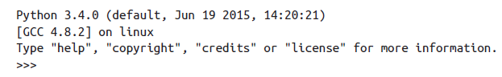

The first three lines contain information about the interpreter and the
operating system it's running on. The last line is a prompt that indicates that
the interpreter is ready for you to enter code.

If you type a line of code and hit Enter, the interpreter displays the result:
                
                >>> 1 + 1
                    2

The basic method for working with interactive mode is simply this:

-   Type a Statement or Expression

-   Press the Enter Key

Let's try to increment a value in the interactive mode

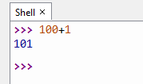

Let's try it with a variable

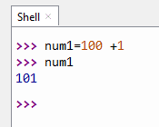

As you can observe the interactive interpreter automatically prints the results
of expressions, you do not need to type complete print statements interactively.
This is one of the coolest features of interpreted programs.

Although the interactive prompt is great for experimenting and testing, it has
one big disadvantage: programs you type there go away as soon as the Python
interpreter executes them. The code you type interactively is never stored in a
file, so you can't run it again without retyping it from scratch.

**2.2 VALUES AND TYPES**

A value is one of the basic things a program works with, like a letter or a
number.

**Example:** 2, 42.0, and 'Hello, World!'

These values belong to different types: 2 is an integer, 42.0 is a
floating-point number, and 'Hello, World!' is a string.

A type specifies the nature of a data. Integers belong to the type int, strings
belong to str, and floating point numbers belong to float.

If you are not sure what type a value has, then using type method we can
determine the value type.

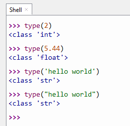

**Integers**

An integer is a number without decimal point. In Python, there is no limit to
how long an integer value can be. Of course, it is constrained by the amount of
memory your system has but beyond that an integer can be as long as you need it
to be:

Python interprets a sequence of decimal digits without any prefix to be a
decimal number:

The following strings can be prepended to an integer value to indicate a base
other than base 10 numbers.

        0b or 0B -- Binary

        0o or 0O-- Octal

        0x or 0X -- Hexadecimal

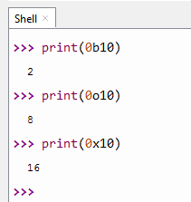

**Floating-Point Numbers**

The float type in Python designates a floating-point number. Float values are
specified with a decimal point. Optionally, the character e or E followed by a
positive or negative integer may be appended to specify scientific notation.

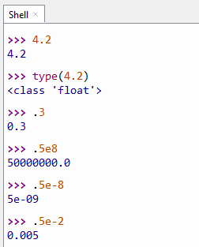

**Strings:**

Strings are sequences of character data. The string type in Python is called
str. String literals may be delimited using either single or double quotes. All
the characters between the opening delimiter and matching closing delimiter are
part of the string.

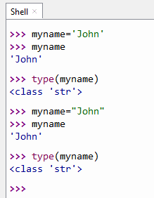

**Boolean Type**

Python provides a Boolean data type. Objects of Boolean type may have one of two
values, True or False. Expressions in Python are often evaluated in Boolean
context, meaning they are interpreted to represent truth or falsehood.

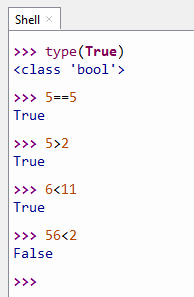

**List:**

A list is a collection which is ordered and changeable. In Python lists are
written with square brackets.

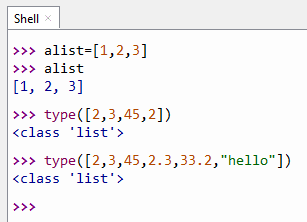

A list can contain different types of data\`s in it. The example above shows
integer, float and string data being present in it.

**2.3 VARIABLES, EXPRESSION AND STATEMENT**

**Variables:** A variable is a name that refers to a value.

**Expression:** An **expression** is a combination of values, variables, and
operators.

**Statements:** Instructions written in the source code for execution are called
statements.

Let briefly discuss about variables, expression and statements.

**2.3.1 Variables**

Variables refer to a value. Every variable has a name associated with it. There
are rules usually programmers follow in naming a variable.

-   A variable name can contain both letter and numbers but they can\`t begin
    with a number.

        Ex., **number1** is legal, but **1drivelink** is illegal.

-   It is legal to use uppercase letters, but it is conventional to use only
    lowercase for variables names.

-   The underscore character, \_ , can appear in a name.

        Ex., your_name or airspeed_of_unladen_swallow.

-   A variable name cannot be a keyword.

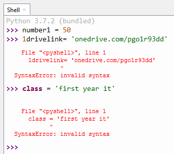

As you can observe the when the variable name 1drivelink is used, which is an
illegal naming convention, the interpreter throws a syntax error. Also by using
the variable class also throws an error, as it is a keyword.

Keywords are reserved words which are used by the interpreter to recognize the
structure of the program, and they cannot be used as variable names. Python has
the following keywords:

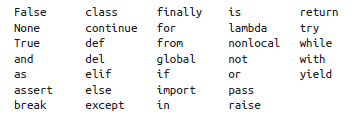

**2.3.2 Expressions and Statements**

An **expression** is a combination of values, variables, and operators. A value
all by itself is considered an expression. An interpreter evaluates an
expression and then returns the result.

**Example:** 4 + 3

In this example the expression contains two values and an arithmetic operator.
The interpreter evaluates the expression and returns the result of the
operation.

A **statement** is a unit of code that the Python interpreter can execute.

**Example:**

            >>> n = 17

            >>> print (n)

In the above example. The first line is an assignment statement and the second
line is a print statement.

A python program contains a sequence of statements. If there is more than one
statement, the results appear one at a time as the statements execute.

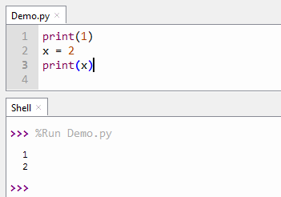

**2.4 Tuple Assignment**

Tuples are sequences, just like lists. The differences between tuples and lists
are, the tuples cannot be changed unlike lists and tuples use parentheses,
whereas lists use square brackets. Creating a tuple is as simple as putting
different comma-separated values.

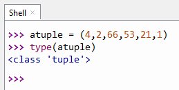

Tuple Assignment is a powerful feature in python that allows a tuple of
variables on the left of an assignment to be assigned values from a tuple on the
right of the assignment.

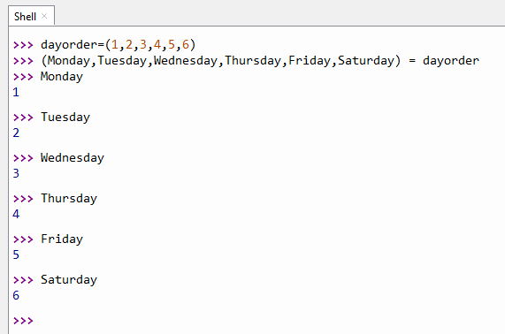

As you observe the above example dayorder is a tuple that is assigned to a tuple
of variables. This is like assigning six variables in one stretch. Now if you
individually display the variables, the values assigned to it can be seen. One
requirement is that the number of variables on the left must match the number of
elements in the tuple.

**2.5 Operators and Precedence**

**2.5.1 Operators**

Operators are special symbols that carry out some computations. The values that
an operator acts on are called operands.

There are various types of operators,

-   Arithmetic Operator

-   Comparison Operator

-   Logical Operator

-   Assignment Operator

-   Identity Operator

-   Membership Operator

**Arithmetic operators**

Arithmetic operators are used to perform mathematical operations like addition,
subtraction, multiplication etc.

| **Operator** | **Meaning**                                                                                      | **Example**               |
|--------------|--------------------------------------------------------------------------------------------------|---------------------------|
| \+           | Add two operands or unary plus                                                                   | x + y                     |
| \-           | Subtract right operand from the left                                                             | x - y                     |
| \*           | Multiply two operands                                                                            | x \* y                    |
| /            | Divide left operand by the right one (always results into float)                                 | x / y                     |
| %            | Modulus - remainder of the division of left operand by the right                                 | x % y (remainder of x/y)  |
| //           | Floor division - division that results into whole number adjusted to the left in the number line | x // y                    |
| \*\*         | Exponent - left operand raised to the power of right                                             | x\*\*y (x to the power y) |

<<<<<<< HEAD

=======
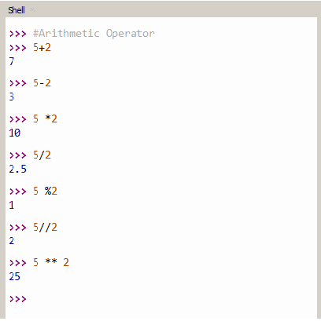
>>>>>>> upstream/master

**Comparison operators:**

Comparison operators are used to compare values. It either returns True or False
according to the condition.

| **Operator** | **Meaning**                                                                            | **Example** |
|--------------|----------------------------------------------------------------------------------------|-------------|
| \>           | Greater than - True if left operand is greater than the right                          | x \> y      |
| \<           | Less than - True if left operand is less than the right                                | x \< y      |
| ==           | Equal to - True if both operands are equal                                             | x == y      |
| !=           | Not equal to - True if operands are not equal                                          | x != y      |
| \>=          | Greater than or equal to - True if left operand is greater than or equal to the right. | x \>= y     |
| \<=          | Less than or equal to - True if left operand is less than or equal to the right        | x \<= y     |

<<<<<<< HEAD

=======
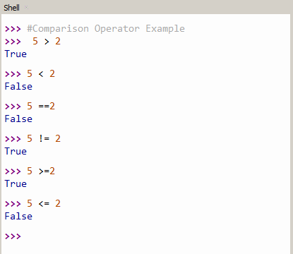
>>>>>>> upstream/master

**Logical operators:**

Logical Operators are used to combine the true or false value of variables and
provides a resultant truth value.

| **Operator** | **Meaning**                                        | **Example** |
|--------------|----------------------------------------------------|-------------|
| and          | True if both the operands are true                 | x and y     |
| or           | True if either of the operands is true             | x or y      |
| not          | True if operand is false (complements the operand) | not x       |

<<<<<<< HEAD

=======
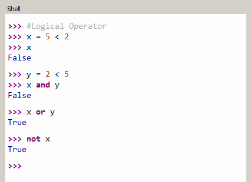
>>>>>>> upstream/master

**Assignment operators**

Assignment operators are used in Python to assign values to variables.

For instance, a = 5 is a simple assignment operation that assigns the value 5 on
the right to the variable **a** on the left.

There are various compound operators in Python like a += 5 that adds to the
variable and later assigns the same. It is equivalent to a = a + 5.

| **Operator** | **Example** | **Equivalent to** |
|--------------|-------------|-------------------|
| =            | x = 5       | x = 5             |
| \+=          | x += 5      | x = x + 5         |
| \-=          | x -= 5      | x = x - 5         |
| \*=          | x \*= 5     | x = x \* 5        |
| /=           | x /= 5      | x = x / 5         |
| %=           | x %= 5      | x = x % 5         |
| //=          | x //= 5     | x = x // 5        |
| \*\*=        | x \*\*= 5   | x = x \*\* 5      |

<<<<<<< HEAD

=======
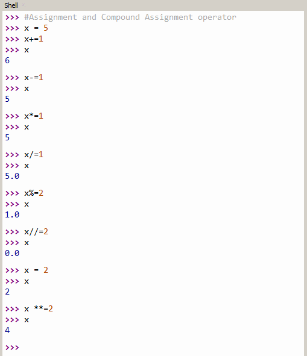
>>>>>>> upstream/master

**Identity operators**

Identity operators are used to verify if two variables point to the same memory
location or not.

| **Operator** | **Meaning**                                                              | **Example**   |
|--------------|--------------------------------------------------------------------------|---------------|
| is           | True if the operands are identical (refer to the same object)            | x is True     |
| is not       | True if the operands are not identical (do not refer to the same object) | x is not True |

<<<<<<< HEAD

=======
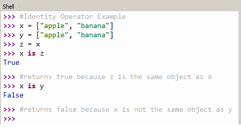
>>>>>>> upstream/master

**Membership Operators**

Membership operators are used to validate the membership of a value. These
operators are used to find out whether a value is a member of a sequence such as
string or list.

| **Operator** | **Meaning**                                         | **Example** |
|--------------|-----------------------------------------------------|-------------|
| in           | True if value/variable is found in the sequence     | 5 in x      |
| not in       | True if value/variable is not found in the sequence | 5 not in x  |

<<<<<<< HEAD

=======
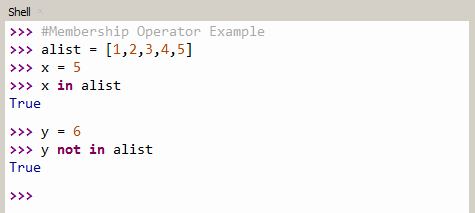
>>>>>>> upstream/master

**2.5.2 Operator Precedence and Associativity**

**Operator Precedence :**

The order of evaluation of operators in an expression is called precedence of an
operator. In Mathematics traditionally we have used certain operator
evaluation order, called PEMDAS rule, which is an acronym for Parenthesis,
Exponentiation, Multiplication, Division, Addition and Subtraction. Mathematical
operators in python also follow the same rule. We call these rules as operator Precedence.

-   Parentheses have the highest precedence and can be used to force an
    expression to evaluate in the order you want.

        **Example:** 2 \* (3-1) is 4, and (1+1) \*\* (5-2) is 8.
        
-   Exponentiation has the next highest precedence.

        **Example:** 1 + 2\*\*3 is 9, not 27

-   Multiplication and Division have higher precedence than Addition and
    Subtraction.

        **Example:** 2\*3-1 is 5, not 4, and 6+4/2 is 8, not 5.

-   Operators with the same precedence are evaluated from left to right

        **Example:** degrees / 2 \* pi, here division is performed first and then
          multiplication happens.

**Associativity :**

Associativity is the order in which Python evaluates an expression containing multiple operators of the same precedence. 
Almost all operators except the exponent (**) support the left-to-right associativity.

For example, the product (*) and the modulus (%) have the same precedence. So, if both appear in an expression, then the left one will get evaluated first.

The only operator which has right-to-left associativity in Python is the exponent (**) operator.

More details on this are in the bonus section. Please refer to it.

**2.6 COMMENTS**

A **comment** is a text that doesn't affect the outcome of a code. It is just a
piece of text to let someone know what you have done in a program or what is
being done in a block of code.

A comment starts with a \# character followed by the text to describe the
section of code.

**Example :**

\#computes the percentage of the hour that has elapsed

percentage = (minute \* 100) / 60

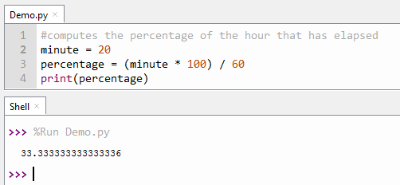

In the above example the first line starts with a comment, during execution the
interpreter ignores executing the line. Comments are merely used to help
developer understand verbally what each section of code is dedicated to achieve.

**2.7 MODULES AND FUNCTIONS**

**2.7.1 FUNCTIONS DEFINITION**

A function is a group of related statements that perform a specific task.
Functions help break our program into smaller and modular chunks. As our program
grows larger and larger, functions make it more organized and manageable.
Furthermore, it avoids repetition and makes code reusable. In order to use a
function, it has to be defined first.

Syntax for function definition:

    def function_name (parameters):

        """docstring"""
    
        statement(s)

The first line of the function definition is called the header. The rest is
called the body.

1.  Keyword **def** marks the start of function header.

2.  A function name to uniquely identify it. Function naming follows the same
    rules of writing identifiers in Python.

3.  Parameters (arguments) through which we pass values to a function. They are
    optional.

4.  A colon (:) to mark the end of function header.

5.  Optional documentation string (docstring) to describe what the function
    does.

6.  One or more valid python statements that make up the function body.
    Statements must have same indentation level (usually 4 spaces).

7.  An optional return statement to return a value from the function.

The above example defines a function named Display_Greetings. The function
accepts a person name as argument and displays a welcome message to him.

**Function Call:**

Once we have defined a function, we can call it from another function, program
or even the Python prompt. To call a function we simply type the function name
followed by parenthesis with appropriate parameters. The above example calls the
function by its name Display_Greetings along with a parameter. Another example
is given below,

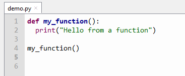

**2.7.2 FLOW OF EXECUTION**

The order in which statements are executed in a program is called flow of
execution. Execution always begins at the first statement of the program.
Statements are executed one at a time, in order from top to bottom.

A function is defined before its first use. Function definitions do not alter
the flow of execution of the program as functions don't run until they are
called. A function call is like a detour in the flow of execution. Instead of
going to the next statement, the flow jumps to the body of the function, runs
the statements there, and then comes back to pick up where it left off. To put
it together, when you read a program, you don't always want to read from top to
bottom. Sometimes it makes more sense if you follow the flow of execution.

**2.7.3 PARAMETERS AND ARGUMENTS**

Parameter is a variable defined by a function that receives a value when the
function is called.

An argument is a value or variable that is passed to a function when it is
invoked.

Some of the functions we have seen require arguments. For example, when you call
**Display_Greetings** you pass a name as an argument. Some functions take more
than one argument.

Here is a definition for a function that takes an argument:

This function assigns the argument to a parameter named **name.** When the
function is called, it prints the value of the parameter (whatever it is) twice.

We can also use any kind of expression as an argument for **print_twice:**

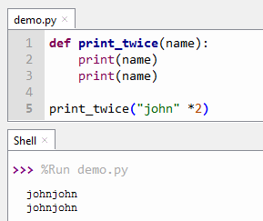

The argument is evaluated before the function is called, so in the examples the
expressions "john" \*2 is only evaluated once.

Another important point to note here is that parameter that we use in a function
only exists inside the function. In the above example, the parameter **name**
only exist in the function print_twice, if we try to print it outside the
function then it will pop an error.

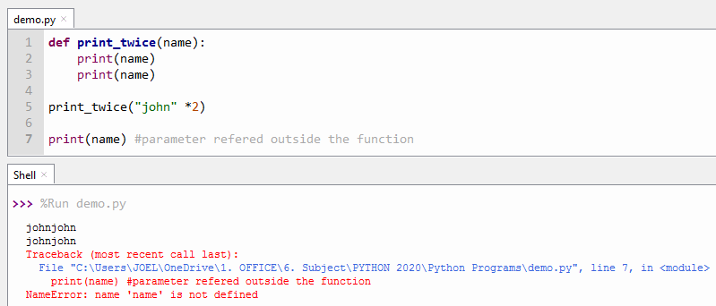

**MODULE:**

A module is a file that contains a collection of related functions. Python has a
math module that provides most of the familiar mathematical functions.

Before we can use the functions in a module, we have to import it with an import
statement:

**Example:** import math

This statement creates a module object named math. The module object contains
the functions and variables defined in the module. To access one of the
functions, you have to specify the name of the module and the name of the
function, separated by a. This format is called dot notation.

In the above figure two math functions were called, one find the square root of
a number and the other prints the power of a number.

___

## **Bonus Section:**

___

**Bitwise Operators**

Bitwise operators act on operands as if they were string of binary digits. It
operates bit by bit, hence the name.

A Binary Number is made up Binary Digits. A bit (short for binary digit) is the
smallest unit of data in a computer. A bit has a single binary value, either 0
or 1.

For example, 2 is 10 in binary and 7 is 111.

For further study on converting decimal to binary visit the link
<https://indepth.dev/the-simple-math-behind-decimal-binary-conversion-algorithms/>

In the below example, Let x = 10 (0000 1010 in binary) and y = 4 (0000 0100 in
binary)

| **Operator** | **Meaning**         | **Example**              |
|--------------|---------------------|--------------------------|
| &            | Bitwise AND         | x& y = 0 (0000 0000)     |
| \|           | Bitwise OR          | x \| y = 14 (0000 1110)  |
| \~           | Bitwise NOT         | \~x = -11 (1111 0101)    |
| \^           | Bitwise XOR         | x \^ y = 14 (0000 1110)  |
| \>\>         | Bitwise right shift | x\>\> 2 = 2 (0000 0010)  |
| \<\<         | Bitwise left shift  | x\<\< 2 = 40 (0010 1000) |

**OPERATOR PRECEDENCE TABLE**

The operator precedence in Python are listed in the following table. The upper
group has higher precedence than the lower ones.

| **Operators**                                    | **Meaning**                                       |
|--------------------------------------------------|---------------------------------------------------|
| ()                                               | Parentheses                                       |
| \*\*                                             | Exponent                                          |
| \+x, -x, \~x                                     | Unary plus, Unary minus, Bitwise NOT              |
| \*, /, //, %                                     | Multiplication, Division, Floor division, Modulus |
| \+, -                                            | Addition, Subtraction                             |
| \<\<, \>\>                                       | Bitwise shift operators                           |
| &                                                | Bitwise AND                                       |
| \^                                               | Bitwise XOR                                       |
| \|                                               | Bitwise OR                                        |
| ==, !=, \>, \>=, \<, \<=, is, is not, in, not in | Comparisons, Identity, Membership operators       |
| Not                                              | Logical NOT                                       |
| And                                              | Logical AND                                       |
| Or                                               | Logical OR                                        |

## **MODULE**

**What is math module in Python?**

The math module is a standard module in Python and is always available. To use
mathematical functions under this module, you have to import the module using
import math.

**Functions in Python Math Module**

Here is the list of all the functions and attributes defined in math module with
a brief explanation of what they do.

| **Function**   | **Description**                                                                             |
|----------------|---------------------------------------------------------------------------------------------|
| ceil(x)        | Returns the smallest integer greater than or equal to x.                                    |
| copysign(x,y)  | Returns x with the sign of y                                                                |
| fabs(x)        | Returns the absolute value of x                                                             |
| factorial(x)   | Returns the factorial of x                                                                  |
| floor(x)       | Returns the largest integer less than or equal to x                                         |
| fmod(x, y)     | Returns the remainder when x is divided by y                                                |
| frexp(x)       | Returns the mantissa and exponent of x as the pair (m, e)                                   |
| fsum(iterable) | Returns an accurate floating point sum of values in the iterable                            |
| isfinite(x)    | Returns True if x is neither an infinity nor a NaN (Not a Number)                           |
| isinf(x)       | Returns True if x is a positive or negative infinity                                        |
| isnan(x)       | Returns True if x is a NaN                                                                  |
| ldexp(x, i)    | Returns x \* (2\*\*i)                                                                       |
| modf(x)        | Returns the fractional and integer parts of x                                               |
| trunc(x)       | Returns the truncated integer value of x                                                    |
| exp(x)         | Returns e\*\*x                                                                              |
| expm1(x)       | Returns e\*\*x - 1                                                                          |
| log(x[, base]) | Returns the logarithm of x to the base (defaults to e)                                      |
| log1p(x)       | Returns the natural logarithm of 1+x                                                        |
| log2(x)        | Returns the base-2 logarithm of x                                                           |
| log10(x)       | Returns the base-10 logarithm of x                                                          |
| pow(x, y)      | Returns x raised to the power y                                                             |
| sqrt(x)        | Returns the square root of x                                                                |
| acos(x)        | Returns the arc cosine of x                                                                 |
| asin(x)        | Returns the arc sine of x                                                                   |
| atan(x)        | Returns the arc tangent of x                                                                |
| atan2(y, x)    | Returns atan(y / x)                                                                         |
| cos(x)         | Returns the cosine of x                                                                     |
| hypot(x, y)    | Returns the Euclidean norm, sqrt(x\*x + y\*y)                                               |
| sin(x)         | Returns the sine of x                                                                       |
| tan(x)         | Returns the tangent of x                                                                    |
| degrees(x)     | Converts angle x from radians to degrees                                                    |
| radians(x)     | Converts angle x from degrees to radians                                                    |
| acosh(x)       | Returns the inverse hyperbolic cosine of x                                                  |
| asinh(x)       | Returns the inverse hyperbolic sine of x                                                    |
| atanh(x)       | Returns the inverse hyperbolic tangent of x                                                 |
| cosh(x)        | Returns the hyperbolic cosine of x                                                          |
| sinh(x)        | Returns the hyperbolic cosine of x                                                          |
| tanh(x)        | Returns the hyperbolic tangent of x                                                         |
| erf(x)         | Returns the error function at x                                                             |
| erfc(x)        | Returns the complementary error function at x                                               |
| gamma(x)       | Returns the Gamma function at x                                                             |
| lgamma(x)      | Returns the natural logarithm of the absolute value of the Gamma function at x              |
| pi             | Mathematical constant, the ratio of circumference of a circle to it's diameter (3.14159...) |
| e              | mathematical constant e (2.71828...)                                                        |
