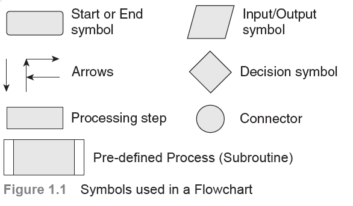
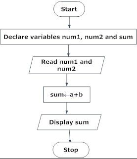
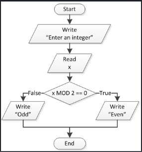
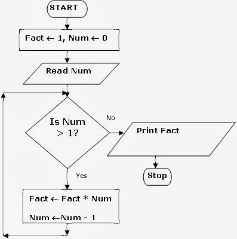



## **UNIT I - ALGORITHMIC PROBLEM SOLVING**

*Algorithms, building blocks of algorithms (statements, state, control flow, functions), notation (pseudo code, flow chart, programming language), algorithmic problem solving, simple strategies for developing algorithms (iteration, recursion).* 

***Illustrative problems:*** *find minimum in a list, insert a card in a list of sorted cards, Guess an integer number in a range, Towers of Hanoi.*

### INTRODUCTION 
A program is a set of instructions that tells the computer how to solve a particular problem. Various program design tools like algorithms, pseudocodes and flowcharts are used to design the blueprint of the solution (or the program to be written). 
Computer programming goes a step further in problem solving process. Programming means writing computer programs. While programming, the programmers take an algorithm and code the instructions in a particular programming language so that it can be executed by a computer. These days, there are many programming languages available in the market. The programmer can choose any language depending on his expertise and the problem domain
### ALGORITHMS
In computing, we focus on the type of problems categorically known as **algorithmic problems**, where their solutions are expressible in the form of algorithms. The term ‘***algorithm***’ was derived from the name of Mohammed al-Khwarizmi, a Persian mathematician in the nineth century (Al-Khwarizmi → Algorism (in Latin) → Algorithm). 
The typical meaning of an algorithm *is a formally defined procedure for performing some calculation*. If a procedure is formally defined, then it must be implemented using some formal language, and such languages are known as programming languages. The algorithm gives the logic of the program, that is, a step-by-step description of how to arrive at a solution.
In general terms, ***an algorithm provides a blueprint to writing a program to solve a particular problem. It is considered to be an effective procedure for solving a problem in a finite number of steps.*** That is, a well defined algorithm always provides an answer, and is guaranteed to terminate. Algorithms are mainly used to achieve software reuse. 
<![endif]-->

**_Real Life Example_**
**_Procedure to cook Bread Toast_**
_Step 1 : Grab a loaf of bread_
_Step 2 : Get a pan and place it on the stove let it heat_
_Step 3 : Pour some oil on the pan and wait for oil to be heated_
_Step 4 : Put a slice on the pan and roast until it become brown in shade_
_Step 5 : Turn the slice and roast until it become brown in shade_
_Step 5 : Get the toasted bread from the pan and serve it on a plate with anything or nothing._

_The above procedure that explains “how to make a bread toast” and what are all the requirements before we start the procedures. We can code this procedure or algorithm in any programming language of your choice and simulate as results on the computer display. Else we can feed this procedure to the robot with proper instructions and we make the robot to do the bread toast for us._

**_Example :_**
**Algorithm for adding two numbers:**
_Step 1 : Get the 2 numbers from the user as input._
_Step 2 : Perform addition of those 2 numbers._
_Step 3 : Store the answer for display._
_Step 4 : Display the stored value to the user._

***Why We need Algorithm***
Three reasons for using algorithms are efficiency, abstraction and reusability.

**_Efficiency_**: Certain types of problems, like sorting, occur often in computing. Efficient algorithms must be used to solve such problems considering the time and cost factor involved in each algorithm.

**_Abstraction_**: Algorithms provide a level of abstraction in solving problems because many seemingly complicated problems can be distilled into simpler ones for which well known algorithms exist. Once we see a more complicated problem in a simpler light, we can think of the simpler problem as just an abstraction of the more complicated one. For example, imagine trying to find the shortest way to route a packet between two gateways in an internet. Once we realize that this problem is just a variation of the more general shortest path problem, we can solve it using the generalised approach.

**_Reusability_**: Algorithms are often reusable in many different situations. Since many well-known algorithms are the generalizations of more complicated ones, and since many complicated problems can be distilled into simpler ones, an efficient means of solving certain simpler problems potentially lets us solve many complicated problems.

### Characteristics of Algorithm
• Precision: The instructions should be written in a precise manner. 

•Uniqueness: The outputs of each step should be unambiguous, i.e., they should be unique and only depend on the input and the output of the preceding steps.

• Finiteness: Not even a single instruction must be repeated infinitely.

• Effectiveness: The algorithm should designed in such a way that it should be the most effective among many different ways to solve a problem. 

• Input: The algorithm must receive an input. 

• Output: After the algorithm gets terminated, the desired result must be obtained.

• Generality: The algorithm can be applied to various set of inputs

### BUILDING BLOCKS OF ALGORITHM (INSTRUCTIONS, STATE, CONTROL FLOW, FUNCTIONS)
**Building Blocks of Algorithms are,**
		 Computer is not smart as we humans. It requires a much more than single instruction to do any task. We can express our needs to computer using the algorithms. Algorithms includes basic building blocks, That is used to express any kind of the task to the computer
		 **_1. Instructions/ Statements_**
		 **_2. State_**
		 **_3. Control Flow_**
		 **_4. Functions_**

**_1. Instructions/ Statements_**

In computer programming, a statement is the smallest standalone element of an imperative programming language that expresses some action to be carried out. It is an instruction written in a high-level language that commands the computer to perform a specified action.

There are two types of statement,
● Simple Statement
● Compound Statement

**_Simple Statements_**
It is used to represent single action need to be done.

● **assertion**: assert(ptr != NULL);
> Comparison 
> 
● **assignment**: A:= A + 5
> Assigning a value 5 to A
> >
● **goto**: goto next;
>Sent the control to different block of same program
>>
● **return**: return 5;
> Return a value 5 after the execution of function
> 
● **call**: CLEARSCREEN()
> Calling the Function (ClearScreen) which performs clearing previous outputs from the computer screen>

**_Compound Statement_**

It is a set of statements, that used to perform a sequence of operations repeatedly or condition based executions.

● >**_block_**: begin integer NUMBER; WRITE('Number? '); READLN(NUMBER); A:= A*NUMBER end
> Set of statements
>
● **_do-loop_**: do { computation(&i); } while (i < 10);
> Looping a set of statements repeatedly until some condition is satisfied. We can’t predict when the condition become satisfiable. At least it will do the loop sequence once.>

● **_for-loop_**: for A:=1 to 10 do WRITELN(A) end
>Looping a set of statements repeatedly until some condition is satisfied. We can run the loop for certain iterations. Prediction of loop termination is possible.>

● **_if-statement_**: if A > 3 then WRITELN(A) else WRITELN("NOT YET"); end
>Normally it contains two sets of statements. State or value is compared with a conditions if it is satisfied the “if” block will be executed otherwise else part will be executed.>

● **_switch-statement_**: switch (c) { case 'a': alert(); break; case 'q': quit(); break; }
>It contains more than two blocks of statement each one has the conditions. When a program reaches a state with a value.  First hit of matching conditions block will be executed. If nothing matches then default block of statements will be executed
>
● **_while-loop_**: while NOT EOF DO begin READLN end
>Looping a set of statements repeatedly until some condition is satisfied. We can’t predict when the condition become satisfiable. This is loop is entry controlled. Control will enter into the loop only if condition is satisfiable.>

**2 State:**

In information technology and computer science, a program is described as stateful if it is designed to remember preceding events or user interactions; the remembered information is called the state of the system.

If a program gets sufficient datas processed then it moves to another state. A successful execution of program include the reaching the  final state of the program.

**3 Control Flow:**

In computer science, control flow (or flow of control) is the order in which individual statements, instructions or function calls of an imperative program are executed or evaluated.

**Control Flow Statement**

Within an imperative programming language, a control flow statement is a statement which execution results in a choice being made as to which of two or more paths to follow.

**Control Flow Statement Categories**
● Continuation at a different statement (*unconditional branch or jump*)
● Executing a set of statements only if some condition is met (choice - i.e., *conditional branch*)
● Executing a set of statements zero or more times, until some condition is met (i.e., loop - the same as conditional branch)
● Executing a set of distant statements, after which the flow of control usually returns (subroutines, coroutines, and continuations)
● Stopping the program, preventing any further execution (unconditional halt)

**Primitive Control Statements**

● **_Labels_**
A label is an explicit name or number assigned to a fixed position within the source code, and which may be referenced by control flow statements appearing elsewhere in the source code. A label marks a position within source code, and has no other effect.
Eg:
**LET** X = 3
**PRINT** X

● **_Goto_**

The goto statement (a combination of the English words go and to, and pronounced accordingly) is the most basic form of unconditional transfer of control.
Eg:
**goto** label

● **_Subroutines_**

A piece of code was written once and then used many times from various other places in a program. The terminology for subroutines varies; they may alternatively be known as routines, procedures, functions (especially if they return results) or methods (especially if they belong to classes or type classes).

● **_Sequence_**

In structured programming, the ordered sequencing of successive commands is considered one of the basic control structures, which is used as a building block for programs alongside iteration, recursion and choice.

● **_Other Control Flow Statements_**

○ **_Choice_**
- If-then-(else) statements
- Case and switch statements 

○ **_Loops_**
- Count-controlled loops
- Condition-controlled loops
- Collection-controlled loops

**4 Functions:**

module - A small component of a computer program that may contain several routines. parameter In computer programming, a parameter is a value that is passed into a function or procedure. procedure A section of computer code that performs a specific task.

Functions "Encapsulate" a task (they combine many instructions into a single line of code). Most programming languages provide many built in functions that would otherwise require many steps to accomplish, for example computing the square root of a number. In general, we don't care how a function does what it does, only that it "does it"!

When a function is "called" the program "leaves" the current section of code and begins to execute the first line inside the function. Thus the function "flow of control" is:

 1. The program comes to a line of code containing a "function call".
 2. The program enters the function (starts at the first line in the function code).
 3. All instructions inside of the function are executed from top to bottom.
 4. The program leaves the function and goes back to where it started from.
 5. Any data computed and RETURNED by the function is used in place of the function in the original line of code.
 
**_Why do we Write Functions?_**

1. They allow us to conceive of our program as a bunch of sub-steps. (Each sub-step can be its own function. When any program seems too hard, just break the overall program into sub-steps!)
2. They allow us to reuse code instead of rewriting it.
3. Functions allow us to keep our variable namespace clean (local variables only "live" as long as the function does). In other words, function_1 can use a variable called i, and function_2 can also use a variable called i and there is no confusion. Each variable i only exists when the computer is executing the given function.
4. Functions allow us to test small parts of our program in isolation from the rest. This is especially true in interpreted languages, such as Matlab, but can be useful in C, Java, ActionScript, etc.

**_Steps to Writing a Function_**

1. Understand the purpose of the function.
2. Define the data that comes into the function from the caller (in the form of parameters)!
3. Define what data variables are needed inside the function to accomplish its goal.
4. Decide on the set of steps that the program will use to accomplish this goal. (The Algorithm)

**_Types of Functions_**

● **_Parameterised Functions_**
- This a functions that receives input while calling. It may or may not return any value to the caller.

● **_Non-Parameterised Function_**
- This a functions does not receive any input while calling. It may or may not return any value to the caller.

**Notation of algorithm**

Algorithms are basically a set of instructions that, if correct and if followed carefully, produce some desired result. Since they are sets of instructions, they are generally presented in such a way that that the step-by-step nature of how they should be followed is readily apparent. The two most common representations are pseudocode and flowcharts.

Algorithms can be thought of as the recipe for taking the general solution for a class of problem and applying it to a specific instance of a problem covered by that class. For instance, the class of problem might be to find the surface area of a sphere given its radius. Through some problem solving means - perhaps by performing the fundamental calculus computation or perhaps simply by looking up the equation in a math book - we determine that the general solution to the problem is that the area is four times pi times the square of the radius. We can then use this general solution and create an algorithm that permits use to compute the surface area of a specific sphere:

>TASK: Compute the surface area of a sphere <br>
GET: radius<br>
SET: area = 4pi*radius*radius >
<br>

**_Pseudocode_**

Pseudocode is an artificial and informal language that helps programmers develop algorithms. Pseudocode is a "text-based" detail (algorithmic) design tool.

The rules of Pseudocode are reasonably straightforward. All statements showing "dependency" are to be indented. These include while, do, for, if, switch. Examples below will illustrate this notion.

**_Rules for Pseudocode Writing_**

1. For looping and selection, The keywords that are to be used include Do While...EndDo; Do Until...EndDo; Case...EndCase; If...Endif; Call ... with (parameters); Call; Return ....; Return; When; Always use scope terminators for loops and iteration.
2. As verbs, use the words Generate, Compute, Process, etc. Words such as set, reset, increment, compute, calculate, add, sum, multiply, ... print, display, input, output, edit, test , etc. with careful indentation tend to foster desirable pseudocode.
3. Do not include data declarations in your pseudocode.

**Examples:**

**_For finding the given number is odd or even:_**

_Input any number_<br>
_Compute modulo for that  number_<br>
_If modulo value equals to zero_<br>
_ Print “The number is Even”_<br>
_Else_<br>
_Print “The number is Odd”_<br>
_End_<br>


#### **Documentation Keywords**

Documentation keywords describe what needs to be done or provides information about why something is being done. You will quickly discover that, if you have done a decent job of writing your pseudocode, that these lines make very useful comment lines in your final code.

● TASK:
>A TASK statement is something that the program must perform but that is described at a level more abstract than what can be coded directly. One way to think of it is that you break a problem down into a set of TASKs. Each TASK can, in turn, be broken down into more narrowly defined TASKs. At some point, the TASK can be described in terms of steps that can be directly implemented. From one perspective, anytime a TASK: keyword is used, it means that there should (or at least could) be a subordinate level of the hierarchy which is the pseudocode for that TASK. In practice, that pseudocode need not be present if the TASK is sufficiently narrow that the person implementing it can go directly from the TASK description to the actual code without the benefit of the detailed steps.

● REM:
>A REM statement is merely a remark or comment. They are useful if the TASK statement proves to be insufficient to convey all the desired information or if the reason that something is done or why it works is not obvious..

#### **Action Keywords**

Action keywords are the lines that actually do the work. There are three basic actions that can be carried out: changing the value stored at some location in memory, getting input from some device, or generating output to some device. We will use the SET, GET, and PUT keywords for these actions respectively.

● SET:

This is an "action" keyword that denotes performing some operation that changes a value in memory. The most common example would be the evaluation of some equation.

● PUT:

This is an "action" keyword that denotes an output operation, generally to the screen. If the destination is anything other than the screen, such as a file or the serial port, then that should be explicitly stated.

● GET:

This is an "action" keyword that denotes in input operation, generally from the keyboard. It is generally understood that there is an implied SET action involved where the value brought in gets stored in some memory location. If the source is anything other than the keyboard, such as a file or the serial port, then that should be explicitly stated.


#### **Flow Control Keywords**

While the action keywords perform the actual work, they are insufficient in and of themselves to write all but the most trivial programs. Of the three structured programming constructs, the action keywords are only sufficient to implement the first of them, namely a sequence of instructions. A program's true power comes from the other two - selection and repetition - because they give it the ability to select whether a particular action will actually be carried out based on the information made available to it at the time that it is executed. This ability is the result of controlling the flow of the program which is the purpose of the flow control keywords.

Because flow control is a more complex task that merely executing a single statement, all but the simplest flow control keywords are used in groups and there are some options in how to use them depending on the specific situation.

Selection - Case 1

● SEL: (test condition)

- TRUE : Statement(s) to be executed if test condition is TRUE
- FALSE : Statement(s) to be executed if test condition is FALSE

Selection - Case 2

● IF: (test condition)
-  Statement(s) to be executed if test condition is TRUE-

● ELSE:
- Statement(s) to be executed if test condition is FALSE

The advantage of Case 1 is that it clearly identifies the block as a selection construct, but it is a bit more involved than is usually necessary. The format of Case 2 is very close to the format of the actual C code that would result and is therefore a bit more straightforward to convert in the coding process, but not enough so as to be a significant factor.

In a legal outline, the ELSE: statement in Case 2 would be numbered one more than the IF: statement - in other words, if the IF: statement was numbered 3.4.2.6) then the ELSE: statement would be numbered 3.4.2.7). This can be useful or confusing depending upon how you think of it. If you think of the test condition controlling a single selection construct, then it would be nice if the controlling expression was one level in the outline and everything it controls was at a lower level. So this could be a bit confusing. However, this format actually emphasizes the fact that, in C, an "else" statement truly is a separate statement and that it must immediately follow an "if" statement that is at the same level of control. Neither convention is significantly better than the other - and you should quickly get comfortable with whichever you choose to use.

Repetition - Case 1

● LOOP:

- WHILE: (test condition)
- Statement(s) to be executed if test condition is TRUE

Repetition - Case 2
● LOOP:

- Statement(s) to be executed if test condition is TRUE
- WHILE: (test condition)


These two cases map directly into the while() and do/while() looping constructs of the C language. In Case 1, the test condition is evaluated prior to making the first pass through the statements controlled by it and, as a result, the possibility exists that those statements won't be executed even once. The only difference in Case 2 is that the statements controlled by the test condition are executed one time and the test is evaluated after that first pass. If the test condition is TRUE then another pass is made - and the test condition evaluated at the end of that and each succeeding pass until the test finally fails.

While the two cases above are more than adequate to represent any looping logic - in fact, either one of them by itself is sufficient, just more cumbersome in some cases - the logic is sometime clearer to the reader if it is expressed in terms of repeating the loop until some some condition is met - meaning that the loop is terminated as soon as the test condition becomes TRUE.


Repetition - Case 3

● LOOP:

 - UNTIL: (test condition)
 - Statement(s) to be executed if test condition is FALSE

Repetition - Case 4

● LOOP:

 - Statement(s) to be executed if test condition is FALSE
- UNTIL: (test condition)


Although C does not support a "loop until" construct (some languages do) converting Case 3 to an equivalent form of Case 1 is trivial - you simply invert the test condition. Similarly, Case 4 can be converted to Case 2 by the same mechanism.

Just as the selection construct can be streamlined, so too can a couple of the repetition constructs.

Repetition - Case 5 (streamlined version of Case 1)

● WHILE: (test condition)
- Statement(s) to be executed if test condition is TRUE

Repetition - Case 6 (streamlined version of Case 3)

● >UNTIL: (test condition)
- Statement(s) to be executed if test condition is FALSE

Streamlining the other two is more difficult because, since the test comes at the end of the statement within the loop, it is very useful to mark the beginning of those statements in such a way that the fact that it is a loop is readily apparent to the reader. The LOOP: statement does that about as well as any other option would.

As you code loops, you will discover that it is frequently the case that there are steps that are logically associated with the loop but which must reside outside of the loop code. The most common by far is the need to initialize certain variables, especially counters, prior to entering the loop. Much less frequently, it is necessary to perform some cleanup tasks immediately after the loop is exited. A pseudocode construct that gathers all of these together so that their association is obvious is the following:

Repetition - Case 7
● REP:<br>
○ PRE:<br>
■ Statement(s) to be executed prior to entering loop<br>
○ WHILE: (test condition)<br>
■ Statement(s) to be executed if test condition is TRUE<br>
○ LOOP:<br>
○ POST:<br>
	■ Statement(s) to be executed prior after the loop is finished<br>
	
The above can be easily altered so as to cover all four of the first four cases. As shown, it implements Case 1. By switching the WHILE: and LOOP: statements it implements Case 2. Similarly, Case 3 is obtained simply by changing the WHILE: to UNTIL: and swapping the UNTIL: with the LOOP: then generated Case 4.


### **Examples**

***Pseudo Code for Sum of two numbers:***

TASK : Sum of two numbers<br>
READ num1<br>
READ num2<br>
Compute SUM:<br>
Sum = num1 + num2<br>
EndSUM<br>
DISPLAY Sum<br>
End<br>
End TASK<br>

***Pseudocode to find given number is odd or even***

TASK: Find Odd or Even:<br>
READ number<br>
Compute MODULO:<br>
Mod = number % 2;<br>
End MODULO<br>
IF Mod = 0:<br>
PRINT “Number is Even”<br>
ELSE:<br>
PRINT “Number is Odd”<br>
End TASK<br>

***Pseudocode to find factorial of given number***
TASK: Finding Factorial of a number <br>
READ number<br>
Initialize Fact to 0 and CurrentVal to number<br>
WHILE CurrentVal is not 1:<br>
IF CurretVal >= 1:<br>
Fact = Fact * CurrentVal<br>
CurretVal = CurretVal - 1<br>
EndIF<br>
Else<br>
Print Fact<br>
End WHILE<br>
End <br>
End TASK <br>


## **Flowcharts**

Flowcharts are a graphical means of representing an algorithm, as should be expected, they have advantages and disadvantages compared to pseudocode. One of their primary advantages is that they permit the structure of a program to be easily visualized - even if all the text were to be removed. The human brain is very good at picking out these patterns and keeping them "in the back of the mind" as a reference frame for viewing the code as it develops.

Most programmers also find it easier to sketch flowcharts on a piece of paper and to modify them by crossing out connection arrows and drawing new ones that they would working with pseudocode by hand. By the same token, most programmers do not like to develop flowcharts in an electronic format because the overhead of creating and modifying it is generally more than they want to deal with while pseudocode lends itself to such electronic development.

Furthermore, if the pseudocode is already in an electronic format that has been structured to lend itself to translation to the final language - such as the one recommended in the previous section - then doing so can be a very simply matter of copying the pseudocode to a new file, overlaying the necessary syntax associated with the language, and compiling the result. This can be a powerful advantage of pseudocode over flowcharts where the entire source code still has to be typed by hand unless you are fortunate to have a tool that can take a flowchart - typically developed using that same tool - and translating it to directly to code. Such tools do exist - and they tend to be rather expensive.

Now that we have looked as some of the pros and cons of flowcharts relative to pseudo code, let's delve into flowcharting itself. The idea behind a flowchart is that it links together a series of blocks each of which perform some specific task. Each of these tasks is represented by a block and has exactly one arrow leading to it and, more importantly, one arrow exiting from it. This is key to the concept of a "structured program".

The shape of the block may convey additional information about what is happening. For instance, a rectangular block is frequently used to indicated that a computation is occurring while a slanted parallelogram is used to indicate some type of input or output operation. The diversity of shapes that can be used and what they mean is staggering - for instance a different shape can be used to indicated output to a tape drive versus to a hard disk or to indicate output in text format verses binary format. By using such highly specialized symbols, much of what is happening can be conveyed by the symbols themselves. But the power of using these distinctions is generally only useful to people that work with flowcharts continuously, professionally, and who are describing very large and complex systems. At our level, it is far better to restrict ourselves to a minimum number of shapes and explicitly indicate any information that otherwise might have been implied by using a different shape.




**_Circle - Entry/Exit Point_**

The circle indicates the entry and exit point for the program - or for the current segment of the program. The entry point has exactly one arrow leaving it and the exit point has exactly one arrow entering it. Execution of the program - or of that segment of the program - always starts at the entry point and finishes at the exit point.

**_Rectangle - Task_**

The rectangle represents a task that is to be performed. That task might be as simple as incrementing the value of a single variable or as complex as you can imagine. The key point is that it also has a single entry point and a single exit point.

**_Parallelogram - Input/Output_**

The parallelogram is used to indicate that some form in input/output operation is occurring. They must also obey the single entry single exit point rule which makes sense given that they are a task-block except with a slightly different shape for the symbol. We could easily eliminate this symbol and use the basic rectangle but the points at which I/O occur within our programs are extremely important and being able to easily and quickly identify them is valuable enough to warrant dealing with a special symbol.

Since a Task block can be arbitrarily complex, it can also contain I/O elements. Whether to use a rectangle or a parallelogram is therefore a judgment call. One way to handle this is to decide whether a task's primary purpose is to perform I/O. Again, that is a judgment call. Another option is to use a symbol that is rectangular on one side and slanted on the other indicating that it is performing both I/O and non-I/O tasks.

**_Diamond - Decision Point_**

The diamond represents a decision point within our program. A question is asked and depending on the resulting answer, different paths are taken. Therefore a diamond has a single entry point but more than one exit point. Usually, there are two exit points - one that is taken if the answer to the question is "true" and another that is taken if the answer to the question is "false". This is sufficient to represent any type of branching logic including both the typical selection statements and the typical repetition statements. However, most languages support some type of "switch" or "case" statement that allows the program to select one from among a potentially large set of possible paths. The basic two-exit-point diamond is fully capable of representing this construct, but it is generally cleaner and more useful to represent it using a as many exit points from the diamond as there are paths.

**_Arrow - Interblock Flow_**

The arrows simply show which symbol gets executed next. The rule is that once an arrow leaves a symbol, it must lead directly to exactly one other symbol - arrows can never fork and diverge. They can, however, converge and join arrows coming from other blocks.

####  Examples ####

 ***Sum of two numbers flow chart***
 


***Finding number is even or odd***



***Program to Find a factorial of the given number***




**programming language notation**

A programming language is a formal language that specifies a set of instructions that can be used to produce various kinds of output. Programming languages generally consist of instructions for a computer. Programming languages can be used to create programs that implement specific algorithms.

Eg : C, C++, COBAL, JAVA, Python ... etc

Programing language consist of syntax and semantics to processed by the compiler or interpreter we must represent our logic with proper notations otherwise the program won’t work at all.

**_Let’s take a python program to compute sum of two numbers,_**
``` 
num1 = input('Enter first number: ')
num2 = input('Enter second number: ')
# Add two numbers3
sum = int(num1) + int(num2)
# Display the sum
print(sum)
```
**_Let’s take a C program to compute sum of two numbers,_**

```
#include<stdio.h>
int main(){
int num1, int num2, sum;
printf (Enter first number:”);
scanf(“%d”,&num1);
printf (Enter second number:”);
scanf(“%d”,&num2);
sum = num1 + num2;
printf(“%d”, sum)
return 0;
}
```

**_Let’s take a Java program to compute sum of two numbers,_**
```
class Main{
public static void main(String[] args){
int num1, num2, sum;
Scanner in = new Scanner(System.in);
System.out.println(“Enter first number:”);
num1 = in.nextInt();
System.out.println(“Enter second number:”);
num2 = in.nextInt();
sum = num1 + num2;
System.out.println(sum);
}
}
```
Above that we have 3 styles of the programming with 3 different language but achieves the same logic.

The programs different only by syntax and rules

**Python**<br>
●It is dynamic type no declaration of variable needed.<br>
●Just do and display.<br>
● It is based on Dynamic OOPS .<br>

**C**<br><br>
● It is structure oriented we need to declare a variable before we use it.<br>
● Anything that represented as block of codes and do the work.<br>
● It is procedure oriented structured language.<br>

**JAVA**<br>
● It is object oriented derived from C and C++<br>
● Coding style is inherited from C and C++ for easy transformation.<br>
● Everything is considered as objects and depends on dynamic memory allocations.<br>

**_Problem solving with algorithms_**

Problem solving can be achieved so many ways, If you need to done with computers then you must design algorithm and then you must implement algorithm with any of your programming language choice.

**_Algorithms with iteration:_**

In computational mathematics, an iterative method is a mathematical procedure that generates a sequence of improving approximate solutions for a class of problems, in which the n-th approximation is derived from the previous ones. A specific implementation of an iterative method, including the termination criteria, is an algorithm of the iterative method. An iterative method is called convergent if the corresponding sequence converges for given initial approximations.

For Example To find power of a number<br>

Step 1: Get a base number<br>
Step 2: Get a power<br>
Step 3: Initialize result value with number and pow with power<br>
Step 4: Start with pow as 1<br>
Step 5: Multiply result and number then increase pow by one<br>
Step 6: Repeat Step 5 Until pow reaches value of power<br>
Step 7: Break the loop and display the result<br>
Step 8: End<br>

In pseudocode:

TASK: To Find Power of a number<br>
READ number<br>
READ Power<br>
Initialize result with number and pow with Power<br>
WHILE pow < Power:<br>
result = result * number<br>
Increase pow by 1<br>
End Loop<br>
PRINT result<br>
End<br>


**Recursive Algorithm**

A recursive algorithm is an algorithm which calls itself with "smaller (or simpler)" input values, and which obtains the result for the current input by applying simple operations to the returned value for the smaller (or simpler) input. More generally if a problem can be solved utilizing solutions to smaller versions of the same problem, and the smaller versions reduce to easily solvable cases, then one can use a recursive algorithm to solve that problem. For example, the elements of a recursively defined set, or the value of a recursively defined function can be obtained by a recursive algorithm.

If a set or a function is defined recursively, then a recursive algorithm to compute its members or values mirrors the definition. Initial steps of the recursive algorithm correspond to the basis clause of the recursive definition and they identify the basis elements. They are then followed by steps corresponding to the inductive clause, which reduce the computation for an element of one generation to that of elements of the immediately preceding generation.

In general, recursive computer programs require more memory and computation compared with iterative algorithms, but they are simpler and for many cases a natural way of thinking about the problem.

For Example To find power of a number

Step 1: Get a base number <br>
Step 2: Get a power<br>
Step 3: Send a number and power to routine<br>
Step 4: In routine Compare power with 1<br>
&nbsp;&nbsp;&nbsp;&nbsp;&nbsp;&nbsp;Step 5: If it is equal to 1 then return number<br>
&nbsp;&nbsp;&nbsp;&nbsp;&nbsp;&nbsp;Step 6: Else Compute the same routine (Step 4 and 5) with a same number and  reduced power by 1<br>
Step 7: display the result<br>
Step 8: End<br>

In pseudocode:

TASK: To Find Power of a number<br>
&nbsp;&nbsp;&nbsp;&nbsp;&nbsp;&nbsp;&nbsp;&nbsp;&nbsp;READ number<br>
&nbsp;&nbsp;&nbsp;&nbsp;&nbsp;&nbsp;&nbsp;&nbsp;&nbsp;READ Power<br>
&nbsp;&nbsp;&nbsp;&nbsp;&nbsp;&nbsp;&nbsp;&nbsp;&nbsp;result = &nbsp;&nbsp;&nbsp;&nbsp;&nbsp;&nbsp;&nbsp;&nbsp;&nbsp;FIND_POWER number and power<br>
&nbsp;&nbsp;&nbsp;&nbsp;&nbsp;&nbsp;&nbsp;&nbsp;&nbsp;FIND_POWER number and power:<br>
&nbsp;&nbsp;&nbsp;&nbsp;&nbsp;&nbsp;&nbsp;&nbsp;&nbsp;&nbsp;&nbsp;&nbsp;&nbsp;&nbsp;&nbsp;&nbsp;&nbsp;IF power = 1:<br>
&nbsp;&nbsp;&nbsp;&nbsp;&nbsp;&nbsp;&nbsp;&nbsp;&nbsp;&nbsp;&nbsp;&nbsp;&nbsp;&nbsp;&nbsp;&nbsp;&nbsp;&nbsp;&nbsp;&nbsp;&nbsp;&nbsp;&nbsp;RETURN number<br>
&nbsp;&nbsp;&nbsp;&nbsp;&nbsp;&nbsp;&nbsp;&nbsp;&nbsp;&nbsp;&nbsp;&nbsp;&nbsp;&nbsp;&nbsp;&nbsp;&nbsp;ELSE<br>
&nbsp;&nbsp;&nbsp;&nbsp;&nbsp;&nbsp;&nbsp;&nbsp;&nbsp;&nbsp;&nbsp;&nbsp;&nbsp;&nbsp;&nbsp;&nbsp;&nbsp;&nbsp;&nbsp;&nbsp;&nbsp;&nbsp;&nbsp;result = FIND_POWER number and power -1<br>
&nbsp;&nbsp;&nbsp;&nbsp;&nbsp;&nbsp;&nbsp;&nbsp;&nbsp;&nbsp;&nbsp;&nbsp;&nbsp;&nbsp;RETURN result<br>
&nbsp;&nbsp;&nbsp;&nbsp;&nbsp;&nbsp;&nbsp;&nbsp;&nbsp;&nbsp;&nbsp;&nbsp;&nbsp;&nbsp;End FIND_POWER<br>
&nbsp;&nbsp;&nbsp;&nbsp;&nbsp;&nbsp;&nbsp;&nbsp;&nbsp;&nbsp;&nbsp;&nbsp;&nbsp;&nbsp;PRINT result<br><br>
&nbsp;&nbsp;&nbsp;&nbsp;&nbsp;&nbsp;&nbsp;&nbsp;&nbsp;&nbsp;&nbsp;&nbsp;&nbsp;&nbsp;End<br>
End TASK<br>


An algorithm starts from an initial state with some input. The instructions/statements describe the processing that must be done on the input to produce the final output (the final state). Note that an instruction is a single operation which when executed converts one state to other. In the course of processing, data is read from an input device, stored in computer’s memory for further processing, and then the result of the processing is written to an output device. The data is stored in the computer’s memory in the form of variables or constants. 
The state of an algorithm is defined as its condition regarding current values or contents of the stored data. An algorithm is a list of precise steps and the order of steps determines the functioning of the algorithm. 
The flow of control (or the control flow) of an algorithm can be specified as top-down or bottom-up approach. Thus, the flow of control specifies the order in which individual instructions of an algorithm are executed.


